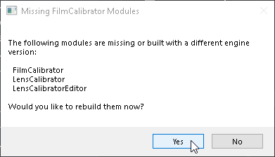
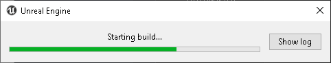

# Lens Calibrator - Unreal Engine Project
## Trailer
[](https://www.youtube.com/watch?vHfIi4gkH9Es)

## Full Walkthrough (~40 min)
If documentation is preferred that can be found [here](https://docs.google.com/document/d/1HNYupII7wy-lZkVENv9LS7f7xqjnMhFPVWmATGc8Xoc/edit?usp=sharing).

[](https://www.youtube.com/watch?CBvmpoI9hAs)

## Supported Unreal Engine Versions
- 4.24
- 4.25
- 4.26

## Installation/Building
1. Recursively clone the repository via:
```git clone --branch master --recursive git@github.com:Polypulse/LensCalibrator.git```
2. Open up an explorer window and navigate into the plugin ```LensCalibratorProject/Plugins/lenscalibrator/```.
3. Hold shift, right click in the window and select *Open Powershell window here*.


4. Execute ```./PullDependencies.ps1``` or download the [OpenCVWrapper](https://github.com/Polypulse/OpenCVWrapper/releases) dependency and extract OpenCVWrapper.zip into ```LensCalibratorProject/Plugins/lenscalibrator/Source/ThirdParty/OpenCVWrapper/```
5. Navigate back to the root of the repo in ```LensCalibratorProject/```.
6. Right click FilmCalibrator.uproject and select "Switch Unreal Engine version..":


7. Select the UE4 version you want to target and click OK:


8. Double click ```FilmCalibrator.uproject``` and when it asks you to recompile, select yes:



9. Wait for it to build:




