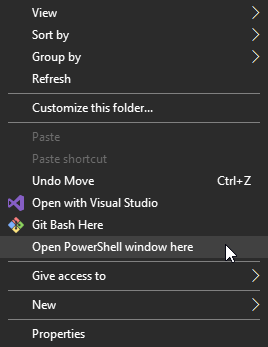

# Lens Calibrator - Unreal Engine Project


## Installation/Building
1. Recursively clone the repository via:
```git clone --branch master --recursive git@github.com:Polypulse/LensCalibrator.git```
2. Open up an explorer window and navigate into the plugin ```LensCalibratorProject/Plugins/lenscalibrator/```.
3. Hold shift, right click in the window and select *Open Powershell window here*.



4. Execute ```./PullDependencies.ps1``` or download the [OpenCVWrapper](https://github.com/Polypulse/OpenCVWrapper/releases) dependency and extract OpenCVWrapper.zip into ```LensCalibratorProject/Plugins/lenscalibrator/Source/ThirdParty/OpenCVWrapper/```
5. Navigate back to the root of the repo in ```LensCalibratorProject/```.
6. Right click FilmCalibrator.uproject and select "Switch Unreal Engine version..":


7. Select the UE4 version you want to target and click OK:

