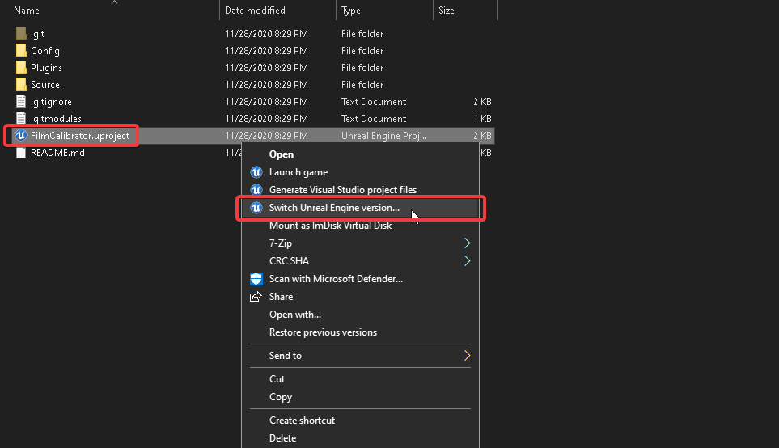
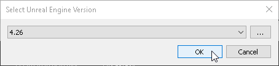

# Lens Calibrator - Unreal Engine Project


## Installation
1. Recursively clone the repository via:
```git clone --branch master --recursive git@github.com:Polypulse/LensCalibrator.git```
2. Right click FilmCalibrator.uproject and select "Switch Unreal Engine version..":

3. Select the UE4 version you want to target and click OK:

